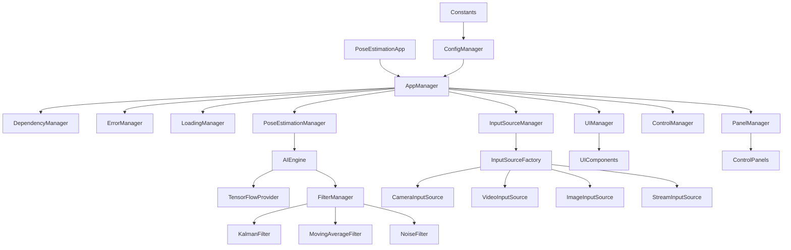

# 模块耦合性与调用关系详细分析

## 🔍 模块调用关系图谱

### 1. 总体调用关系


## 📊 模块耦合度矩阵

### 耦合度评级说明
- **🔴 高耦合 (3)**: 直接依赖，难以替换
- **🟡 中耦合 (2)**: 接口依赖，可替换但需修改
- **🟢 低耦合 (1)**: 松散依赖，易于替换
- **⚪ 无耦合 (0)**: 无直接依赖关系

| 模块A \ 模块B | PoseApp | AppMgr | AIMgr | InputMgr | UIMgr | ConfigMgr | TFProvider | Filters |
|---------------|---------|--------|-------|----------|-------|-----------|------------|----------|
| **PoseEstimationApp** | - | 🔴3 | ⚪0 | ⚪0 | ⚪0 | ⚪0 | ⚪0 | ⚪0 |
| **AppManager** | ⚪0 | - | 🔴3 | 🔴3 | 🔴3 | 🟡2 | ⚪0 | ⚪0 |
| **PoseEstimationManager** | ⚪0 | ⚪0 | - | 🟡2 | 🟡2 | 🟡2 | ⚪0 | ⚪0 |
| **InputSourceManager** | ⚪0 | ⚪0 | ⚪0 | - | ⚪0 | 🟡2 | ⚪0 | ⚪0 |
| **UIManager** | ⚪0 | ⚪0 | ⚪0 | ⚪0 | - | 🟡2 | ⚪0 | ⚪0 |
| **AIEngine** | ⚪0 | ⚪0 | ⚪0 | ⚪0 | ⚪0 | 🟡2 | 🔴3 | 🟡2 |
| **TensorFlowProvider** | ⚪0 | ⚪0 | ⚪0 | ⚪0 | ⚪0 | 🟡2 | - | ⚪0 |
| **Filters** | ⚪0 | ⚪0 | ⚪0 | ⚪0 | ⚪0 | 🟢1 | ⚪0 | - |

## 🔗 详细模块分析

### 1. PoseEstimationApp (应用入口)

#### 入口点
- **HTML加载**: `main.html` 中的脚本标签
- **DOM Ready**: `DOMContentLoaded` 事件触发

#### 出口点
- **AppManager初始化**: `this.appManager = new AppManager()`
- **Canvas元素传递**: 传递给AppManager
- **事件监听器绑定**: 窗口resize、错误处理

#### 依赖关系
```javascript
// 直接依赖
import AppManager from './core/managers/AppManager.js';

// 间接依赖（通过AppManager）
// - 所有子管理器
// - AI引擎
// - 输入源管理
```

#### 耦合分析
- **与AppManager**: 🔴 高耦合
  - 直接实例化AppManager
  - 传递DOM元素引用
  - 处理AppManager的错误事件

### 2. AppManager (核心管理器)

#### 入口点
- **PoseEstimationApp调用**: `new AppManager(canvasElement)`
- **初始化方法**: `init()`, `start()`

#### 出口点
- **子管理器创建**: 创建并管理8个子管理器
- **依赖注入**: 通过DependencyManager注入依赖
- **事件分发**: 向各子管理器分发事件

#### 依赖关系
```javascript
// 直接依赖
import DependencyManager from './DependencyManager.js';
import ErrorManager from './ErrorManager.js';
import LoadingManager from './LoadingManager.js';
import UIManager from './UIManager.js';
import PoseEstimationManager from './PoseEstimationManager.js';
import InputSourceManager from '../input/InputSourceManager.js';
import ControlManager from './ControlManager.js';
import PanelManager from './PanelManager.js';

// 配置依赖
import { configManager } from '../config/constants.js';
```

#### 耦合分析
- **与子管理器**: 🔴 高耦合
  - 直接实例化所有子管理器
  - 管理子管理器生命周期
  - 硬编码管理器列表

#### 问题识别
1. **单一职责违反**: 承担过多管理职责
2. **开闭原则违反**: 添加新管理器需修改AppManager
3. **依赖倒置违反**: 依赖具体实现而非抽象

### 3. AIEngine (AI引擎)

#### 入口点
- **PoseEstimationManager调用**: `aiEngine.processFrame()`
- **配置更新**: `updateConfig()`
- **模型切换**: `switchModel()`

#### 出口点
- **TensorFlowProvider调用**: 模型推理
- **FilterManager调用**: 结果滤波
- **性能统计**: 返回处理时间和FPS

#### 依赖关系
```javascript
// 核心依赖
import TensorFlowProvider from './models/TensorFlowProvider.js';
import FilterManager from './filters/FilterManager.js';

// 工具依赖
import { tensorUtils } from './utils/tensorUtils.js';
import { performanceUtils } from './utils/performanceUtils.js';

// 接口依赖
import { IAIEngine } from './interfaces/IAIEngine.js';
```

#### 耦合分析
- **与TensorFlowProvider**: 🔴 高耦合
  - 直接调用TensorFlow API
  - 依赖特定的模型格式
- **与FilterManager**: 🟡 中耦合
  - 通过接口调用
  - 可替换滤波策略

### 4. TensorFlowProvider (模型提供器)

#### 入口点
- **AIEngine调用**: `loadModel()`, `predict()`
- **单例获取**: `TensorFlowProvider.getInstance()`

#### 出口点
- **TensorFlow.js API**: 直接调用tf.js
- **模型推理结果**: 返回关键点数据
- **性能指标**: 返回推理时间

#### 依赖关系
```javascript
// 外部依赖
import * as tf from '@tensorflow/tfjs';
import * as poseDetection from '@tensorflow-models/pose-detection';

// 内部依赖
import { IModelProvider } from '../interfaces/IModelProvider.js';
import { tensorUtils } from '../utils/tensorUtils.js';
```

#### 耦合分析
- **与TensorFlow.js**: 🔴 高耦合
  - 直接依赖tf.js API
  - 模型格式绑定
  - 版本兼容性依赖

#### 单例模式实现
```javascript
class TensorFlowProvider {
    static instance = null;
    
    static getInstance() {
        if (!TensorFlowProvider.instance) {
            TensorFlowProvider.instance = new TensorFlowProvider();
        }
        return TensorFlowProvider.instance;
    }
}
```

### 5. InputSourceManager (输入源管理)

#### 入口点
- **AppManager调用**: `init()`, `createSource()`
- **UI控制**: 切换输入源

#### 出口点
- **InputSourceFactory调用**: 创建具体输入源
- **输入源生命周期**: 管理start/stop/pause
- **数据流**: 向AI引擎提供图像帧

#### 依赖关系
```javascript
// 工厂依赖
import InputSourceFactory from './factory/InputSourceFactory.js';

// 接口依赖
import { IInputSource } from './interfaces/IInputSource.js';
import { INPUT_SOURCE_TYPES } from './interfaces/IInputSource.js';
```

#### 耦合分析
- **与InputSourceFactory**: 🟡 中耦合
  - 通过工厂模式创建
  - 依赖工厂接口
- **与具体输入源**: 🟢 低耦合
  - 通过统一接口交互
  - 易于扩展新类型

### 6. InputSourceFactory (输入源工厂)

#### 入口点
- **InputSourceManager调用**: `createInputSource(type, config)`

#### 出口点
- **具体输入源实例**: 创建Camera/Video/Image/Stream源
- **配置验证**: 返回验证结果

#### 依赖关系
```javascript
// 具体实现依赖
import CameraInputSource from '../sources/CameraInputSource.js';
import VideoInputSource from '../sources/VideoInputSource.js';
import ImageInputSource from '../sources/ImageInputSource.js';
import StreamInputSource from '../sources/StreamInputSource.js';

// 接口依赖
import { INPUT_SOURCE_TYPES } from '../interfaces/IInputSource.js';
```

#### 工厂模式实现
```javascript
class InputSourceFactory {
    static createInputSource(type, config) {
        switch (type) {
            case INPUT_SOURCE_TYPES.CAMERA:
                return new CameraInputSource(config);
            case INPUT_SOURCE_TYPES.VIDEO_FILE:
                return new VideoInputSource(config);
            case INPUT_SOURCE_TYPES.IMAGE_FILE:
                return new ImageInputSource(config);
            case INPUT_SOURCE_TYPES.STREAM:
                return new StreamInputSource(config);
            default:
                throw new Error(`Unsupported input source type: ${type}`);
        }
    }
}
```

### 7. 具体输入源 (CameraInputSource等)

#### 入口点
- **Factory创建**: `new CameraInputSource(config)`
- **生命周期控制**: `init()`, `start()`, `stop()`

#### 出口点
- **图像帧数据**: `getCurrentFrame()`
- **状态事件**: 发布状态变化事件
- **错误处理**: 抛出或发布错误事件

#### 依赖关系
```javascript
// 接口实现
import { IInputSource } from '../interfaces/IInputSource.js';

// Web API依赖
// - navigator.mediaDevices (Camera)
// - HTMLVideoElement (Video)
// - HTMLImageElement (Image)
// - MediaSource API (Stream)
```

#### 耦合分析
- **与Web API**: 🔴 高耦合
  - 直接依赖浏览器API
  - 平台特定实现
- **与IInputSource**: 🟢 低耦合
  - 标准接口实现
  - 易于测试和替换

## 🔄 数据流分析

### 1. 图像数据流
```
输入源 → 数据预处理 → AI引擎 → 滤波处理 → 结果输出
   ↓         ↓          ↓         ↓         ↓
ImageData  标准化格式   Tensor   平滑处理   关键点
```

#### 详细流程
1. **输入源获取**: `inputSource.getCurrentFrame()`
2. **格式转换**: `tensorUtils.imageToTensor()`
3. **模型推理**: `tensorflowProvider.predict()`
4. **结果滤波**: `filterManager.filter()`
5. **数据输出**: 返回处理后的关键点

### 2. 控制流分析
```
UI事件 → 控制管理器 → 业务逻辑 → 状态更新 → UI反馈
   ↓         ↓         ↓         ↓        ↓
用户操作   事件分发   处理逻辑   状态变更  界面更新
```

#### 详细流程
1. **事件捕获**: UI组件捕获用户操作
2. **事件分发**: ControlManager分发事件
3. **业务处理**: 相应管理器处理业务逻辑
4. **状态更新**: 更新应用状态
5. **UI更新**: UIManager更新界面显示

### 3. 错误流分析
```
错误发生 → 错误捕获 → 错误处理 → 错误恢复 → 用户通知
   ↓         ↓         ↓         ↓        ↓
异常抛出   try/catch  错误分类   状态恢复  错误提示
```

## 🚨 耦合问题识别

### 1. 高耦合问题

#### AppManager过度集中
**问题描述**: AppManager直接管理所有子管理器
```javascript
// 问题代码
class AppManager {
    constructor() {
        this.dependencyManager = new DependencyManager();
        this.errorManager = new ErrorManager();
        this.loadingManager = new LoadingManager();
        // ... 更多管理器
    }
}
```

**影响分析**:
- 单点故障风险
- 难以单独测试
- 违反开闭原则
- 代码维护困难

**解决方案**:
```javascript
// 改进方案：插件化架构
class AppManager {
    constructor() {
        this.managers = new Map();
        this.pluginLoader = new PluginLoader();
    }
    
    registerManager(name, manager) {
        this.managers.set(name, manager);
    }
    
    async loadPlugins() {
        const plugins = await this.pluginLoader.loadAll();
        plugins.forEach(plugin => this.registerManager(plugin.name, plugin.manager));
    }
}
```

#### TensorFlow强依赖
**问题描述**: AIEngine直接依赖TensorFlow.js
```javascript
// 问题代码
import * as tf from '@tensorflow/tfjs';

class AIEngine {
    async processFrame(imageData) {
        const tensor = tf.browser.fromPixels(imageData);
        // 直接使用tf API
    }
}
```

**影响分析**:
- 难以切换AI框架
- 测试困难
- 版本升级风险

**解决方案**:
```javascript
// 改进方案：抽象层
interface IAIProvider {
    loadModel(modelUrl: string): Promise<void>;
    predict(input: ImageData): Promise<PoseResult>;
}

class AIEngine {
    constructor(private aiProvider: IAIProvider) {}
    
    async processFrame(imageData: ImageData) {
        return await this.aiProvider.predict(imageData);
    }
}
```

### 2. 循环依赖问题

#### 潜在循环依赖
```
AppManager → PoseEstimationManager → AIEngine → ConfigManager → AppManager
```

**检测方法**:
```javascript
// 依赖检测工具
class DependencyAnalyzer {
    static detectCircularDependencies(modules) {
        const visited = new Set();
        const recursionStack = new Set();
        
        for (const module of modules) {
            if (this.hasCycle(module, visited, recursionStack)) {
                return true;
            }
        }
        return false;
    }
}
```

### 3. 接口不稳定问题

#### 接口变更频繁
**问题**: 某些接口定义不够稳定，经常变更
**影响**: 下游模块需要频繁适配
**解决**: 使用版本化接口和适配器模式

```javascript
// 版本化接口
interface IInputSourceV1 {
    start(): Promise<void>;
    stop(): Promise<void>;
}

interface IInputSourceV2 extends IInputSourceV1 {
    pause(): Promise<void>;
    resume(): Promise<void>;
}

// 适配器
class InputSourceAdapter implements IInputSourceV2 {
    constructor(private legacySource: IInputSourceV1) {}
    
    async pause() {
        await this.legacySource.stop();
    }
    
    async resume() {
        await this.legacySource.start();
    }
}
```

## 📈 解耦优化建议

### 1. 立即优化（高优先级）

#### 实现真正的单例模式
```javascript
// 当前问题：多次初始化
// 解决方案：线程安全的单例
class TensorFlowProvider {
    private static instance: TensorFlowProvider | null = null;
    private static initPromise: Promise<TensorFlowProvider> | null = null;
    
    static async getInstance(): Promise<TensorFlowProvider> {
        if (this.instance) {
            return this.instance;
        }
        
        if (!this.initPromise) {
            this.initPromise = this.createInstance();
        }
        
        return this.initPromise;
    }
    
    private static async createInstance(): Promise<TensorFlowProvider> {
        const instance = new TensorFlowProvider();
        await instance.initialize();
        this.instance = instance;
        return instance;
    }
}
```

#### 统一依赖注入
```javascript
// 依赖注入容器
class DIContainer {
    private services = new Map();
    private singletons = new Map();
    
    register<T>(token: string, factory: () => T, singleton = false) {
        this.services.set(token, { factory, singleton });
    }
    
    resolve<T>(token: string): T {
        const service = this.services.get(token);
        if (!service) {
            throw new Error(`Service ${token} not found`);
        }
        
        if (service.singleton) {
            if (!this.singletons.has(token)) {
                this.singletons.set(token, service.factory());
            }
            return this.singletons.get(token);
        }
        
        return service.factory();
    }
}
```

### 2. 中期优化（中优先级）

#### 事件驱动架构
```javascript
// 事件总线
class EventBus {
    private listeners = new Map<string, Function[]>();
    
    on(event: string, listener: Function) {
        if (!this.listeners.has(event)) {
            this.listeners.set(event, []);
        }
        this.listeners.get(event)!.push(listener);
    }
    
    emit(event: string, data?: any) {
        const listeners = this.listeners.get(event) || [];
        listeners.forEach(listener => listener(data));
    }
    
    off(event: string, listener: Function) {
        const listeners = this.listeners.get(event) || [];
        const index = listeners.indexOf(listener);
        if (index > -1) {
            listeners.splice(index, 1);
        }
    }
}
```

#### 模块化管理器
```javascript
// 可插拔管理器
abstract class BaseManager {
    abstract name: string;
    abstract init(): Promise<void>;
    abstract start(): Promise<void>;
    abstract stop(): Promise<void>;
}

class ManagerRegistry {
    private managers = new Map<string, BaseManager>();
    
    register(manager: BaseManager) {
        this.managers.set(manager.name, manager);
    }
    
    async initAll() {
        for (const manager of this.managers.values()) {
            await manager.init();
        }
    }
    
    async startAll() {
        for (const manager of this.managers.values()) {
            await manager.start();
        }
    }
}
```

### 3. 长期优化（低优先级）

#### 微前端架构
```javascript
// 模块联邦配置
const ModuleFederationPlugin = require('@module-federation/webpack');

module.exports = {
    plugins: [
        new ModuleFederationPlugin({
            name: 'pose_estimator',
            exposes: {
                './AIEngine': './src/ai/AIEngine.js',
                './InputManager': './src/input/InputSourceManager.js',
            },
            shared: {
                '@tensorflow/tfjs': { singleton: true },
            },
        }),
    ],
};
```

#### WebAssembly集成
```javascript
// WASM模块接口
interface WASMModule {
    processImage(imageData: Uint8Array): Uint8Array;
    initializeModel(modelData: Uint8Array): boolean;
}

class WASMAIProvider implements IAIProvider {
    private wasmModule: WASMModule;
    
    async loadModel(modelUrl: string) {
        const modelData = await fetch(modelUrl).then(r => r.arrayBuffer());
        this.wasmModule.initializeModel(new Uint8Array(modelData));
    }
    
    async predict(input: ImageData): Promise<PoseResult> {
        const result = this.wasmModule.processImage(input.data);
        return this.parseResult(result);
    }
}
```

---

*本文档提供了详细的模块耦合分析和优化建议，将指导后续的重构工作*