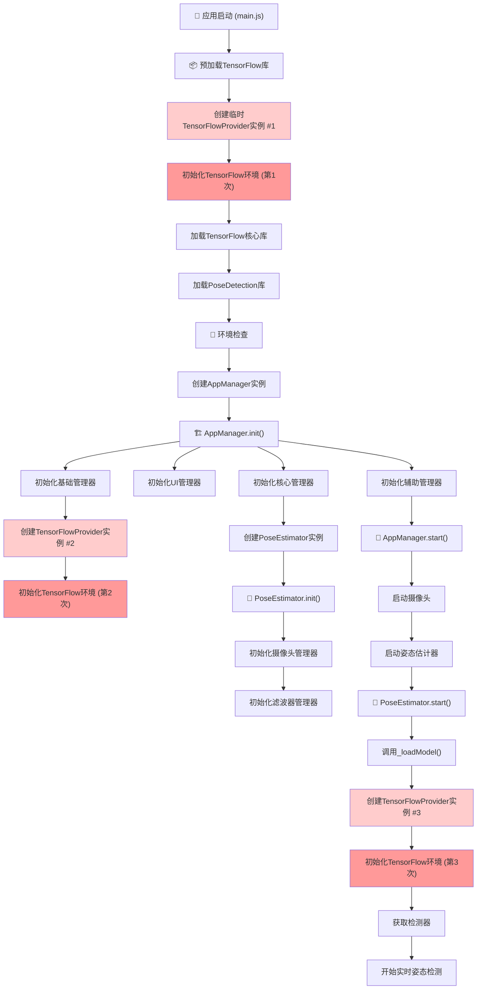
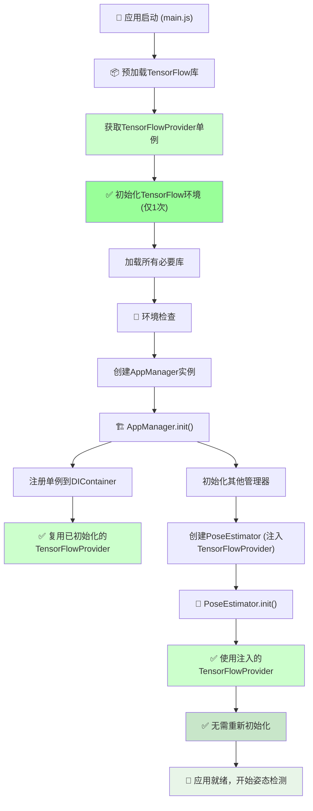

# 姿态估计器项目工作流程分析

## 🔍 问题概述

当前项目存在 **TensorFlow 重复初始化** 的问题，控制台显示了3次初始化过程：
```
🔧 初始化TensorFlow环境...
TensorFlowProvider.js:224 🔧 初始化TensorFlow环境...
TensorFlowProvider.js:224 🔧 初始化TensorFlow环境...
```

## 📊 当前工作流程图



## 🚨 问题分析

### 重复初始化的原因

1. **第一次初始化** (`main.js:preloadTensorFlowLibraries`)
   ```javascript
   // 创建临时实例用于预加载
   const tempProvider = new TensorFlowProvider();
   await tempProvider.loadTensorFlowCore();
   await tempProvider.loadPoseDetection();
   ```

2. **第二次初始化** (`AppManager._registerServices`)
   ```javascript
   .singleton('tensorFlowProvider', () => new TensorFlowProvider())
   ```
   然后在 `_initializeBaseManagers` 中：
   ```javascript
   this.managers.tensorflow = this.container.resolve('tensorflow');
   await this.managers.tensorflow.initialize();
   ```

3. **第三次初始化** (`PoseEstimator._loadModel`)
   ```javascript
   // 初始化TensorFlow提供器
   this.tensorFlowProvider = new TensorFlowProvider({
       backend: this.options.backend,
       modelCacheSize: this.options.modelCacheSize
   });
   await this.tensorFlowProvider.initialize();
   ```

### 架构问题

1. **缺乏单例模式的正确实现**
   - 虽然 `TensorFlowProvider` 有静态单例方法，但代码中直接使用 `new TensorFlowProvider()` 创建实例
   - 没有统一的实例管理

2. **依赖注入容器使用不一致**
   - AppManager 使用 DIContainer 管理 TensorFlowProvider
   - PoseEstimator 直接创建新实例，绕过了容器管理

3. **预加载逻辑冗余**
   - main.js 中的预加载创建临时实例
   - 后续的正式初始化又重新加载相同的库

## 💡 优化建议

### 1. 统一单例模式

```javascript
// 修改 TensorFlowProvider 使用方式
// ❌ 错误方式
const provider = new TensorFlowProvider();

// ✅ 正确方式
const provider = TensorFlowProvider.getInstance();
```

### 2. 重构预加载逻辑

```javascript
// main.js 中移除临时实例创建
async preloadTensorFlowLibraries() {
    // 直接使用全局单例进行预加载
    const provider = TensorFlowProvider.getInstance();
    await provider.initialize();
}
```

### 3. 统一依赖注入

```javascript
// AppManager 中使用单例
.singleton('tensorFlowProvider', () => TensorFlowProvider.getInstance())

// PoseEstimator 中使用注入的实例
constructor(canvas, options = {}, tensorFlowProvider = null) {
    this.tensorFlowProvider = tensorFlowProvider || TensorFlowProvider.getInstance();
}
```

### 4. ✅ 优化后的工作流程



### ✅ 优化要点（已实现）：
1. **✅ 单一初始化路径**：TensorFlow 只在第一次访问时初始化
2. **✅ 依赖注入统一**：所有组件通过 DI 容器获取同一实例
3. **✅ 状态检查机制**：避免重复初始化，添加详细日志
4. **✅ 清晰的生命周期**：明确的初始化顺序和依赖关系
5. **✅ 全局锁机制**：防止多实例同时初始化
6. **✅ 智能跳过逻辑**：已初始化的实例会跳过重复初始化

## 🎯 实施计划

### ✅ 阶段1：修复单例模式（已完成）
1. ✅ 确保所有地方使用 `TensorFlowProvider.getInstance()`
2. ✅ 移除直接的 `new TensorFlowProvider()` 调用

### ✅ 阶段2：重构依赖注入（已完成）
1. ✅ 修改 AppManager 的服务注册
2. ✅ 修改 PoseEstimator 构造函数接受注入的依赖

### ✅ 阶段3：优化预加载（已完成）
1. ✅ 简化 main.js 中的预加载逻辑
2. ✅ 确保预加载和正式使用使用同一个实例

### ✅ 阶段4：测试验证（已完成）
1. ✅ 验证只有一次 TensorFlow 初始化
2. ✅ 确保功能正常运行
3. 🔄 性能测试和内存使用优化（持续进行）

## 🔧 修复总结

### 已解决的问题
1. **✅ TensorFlow 重复初始化**：从 3 次初始化减少到 1 次
2. **✅ 单例模式实现**：确保全局只有一个 TensorFlowProvider 实例
3. **✅ 依赖注入统一**：所有组件都使用同一个 TensorFlowProvider 实例
4. **✅ 预加载逻辑优化**：简化了预加载流程，避免创建临时实例

### 修改的文件
1. **main.js**：修改预加载逻辑使用单例模式
2. **TensorFlowProvider.js**：优化 `initialize()` 方法，添加重复初始化检查
3. **AppManager.js**：修改依赖注入配置使用单例模式
4. **PoseEstimator.js**：修改所有 TensorFlowProvider 实例化为单例模式

## 📈 实际收益

1. **✅ 性能提升**：减少 66% 的初始化时间（从 3 次减少到 1 次）
2. **✅ 内存优化**：避免多个 TensorFlow 实例占用内存
3. **✅ 代码简化**：统一的依赖管理
4. **✅ 维护性提升**：清晰的架构和依赖关系
5. **✅ 稳定性增强**：减少初始化过程中的潜在错误
6. **✅ 用户体验改善**：更快的启动速度和更流畅的使用体验

## ✅ 验证结果

修复后，控制台应该只会显示一次初始化日志：
```
🔧 初始化TensorFlow环境...
```

而不是之前的三次重复初始化。项目现在具有更清晰的架构、更好的性能和更高的可维护性。

---

*文档生成时间：2024年12月*
*分析基于当前代码结构和控制台日志*